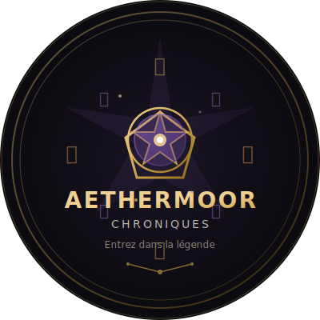

# 🎮 Image d'introduction Aethermoor

## 📦 Fichiers fournis

### 1. **aethermoor-intro.svg** - Image vectorielle
- Format SVG haute qualité
- Scalable à l'infini sans perte
- Parfait pour l'intégration web
- Taille : 400x400px (viewBox)

### 2. **image-generator.html** - Générateur PNG
- Outil pour convertir le SVG en PNG
- Génère deux formats :
  - **1200x1200px** - Pour Open Graph / réseaux sociaux
  - **512x512px** - Pour favicon / icônes

## 🎨 Design

L'image circulaire présente :
- ✨ **Pentacle magique central** avec effets de lueur
- ⚔️ **Runes et symboles** positionnés autour du cercle
- 🌟 **Particules animées** (dans la version SVG)
- 📜 **Titre stylisé** "AETHERMOOR - CHRONIQUES"
- 🎭 **Palette dark fantasy** : or, violet, noir profond

## 📖 Utilisation

### Pour intégrer dans votre page HTML :

```html
<!-- Dans le <head> -->
<link rel="icon" type="image/svg+xml" href="aethermoor-intro.svg">

<!-- Pour Open Graph (après génération PNG) -->
<meta property="og:image" content="https://votredomaine.fr/aethermoor-og-image.png">
```

### Pour générer les PNG :

1. Ouvrir **image-generator.html** dans un navigateur
2. Cliquer sur "Télécharger PNG (1200x1200)" pour l'image Open Graph
3. Cliquer sur "Télécharger Favicon (512x512)" pour l'icône

### Intégration dans la page Aethermoor :

```html
<!-- Hero / Section d'introduction -->
<div style="text-align: center; margin: 40px 0;">
    
</div>
```

## 🎯 Usages recommandés

- **Page d'accueil** : En-tête ou hero section
- **Écran de chargement** : Pendant le chargement du jeu
- **About / À propos** : Présentation du projet
- **Open Graph** : Partage sur réseaux sociaux
- **Favicon** : Icône du site web
- **Documentation** : Logo du projet

## 🔧 Personnalisation

Pour modifier l'image, éditez le fichier SVG :
- Couleurs : Modifiez les valeurs dans `<defs>` (gradients)
- Texte : Changez le contenu des balises `<text>`
- Taille : Ajustez l'attribut `viewBox`
- Effets : Modifiez les filtres `glow` et `strongGlow`

## 📐 Spécifications techniques

### Couleurs utilisées :
- **Or** : #d4a853, #f0d090, #8b6914
- **Violet** : #6b4c9a, #9d7ccc
- **Fond** : #0a0a0f, #0f0c14, #1a1525
- **Texte** : #e8e4dc, #8a8279

### Polices :
- Titre : Cinzel (Google Fonts)
- Sous-titre : Crimson Text (Google Fonts)

## 💡 Conseils SEO

Utilisez l'image PNG 1200x1200 pour :
- Meta tag Open Graph (`og:image`)
- Meta tag Twitter Card (`twitter:image`)
- Assurez-vous que l'URL est absolue (https://)
- Taille optimale pour partage social

---

**Créé pour MODE 83 | Chroniques d'Aethermoor**
